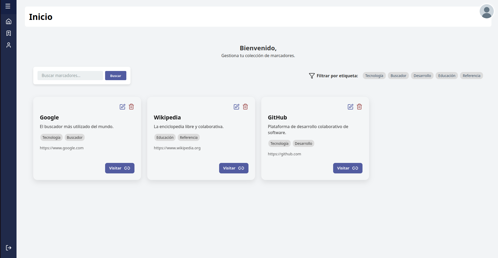

# GuardaLink - Gestor de Marcadores Web

## Descripción del Proyecto
GuardaLink es una aplicación web desarrollada con Flask que permite a los usuarios gestionar sus marcadores de páginas web de forma organizada. Los usuarios pueden crear, leer, actualizar y eliminar marcadores, organizarlos con etiquetas personalizadas, y buscar entre ellos fácilmente. La aplicación incluye un sistema de autenticación con roles de usuario (normal y administrador) y una interfaz intuitiva para la gestión eficiente de enlaces favoritos.



## Tecnologías Usadas
- [Python 3](https://www.python.org/) - Lenguaje de programación principal
- [Flask 3.1.1](https://flask.palletsprojects.com/) - Framework web para Python
- [SQLite](https://www.sqlite.org/) - Base de datos ligera integrada
- [Jinja2 3.1.6](https://jinja.palletsprojects.com/) - Motor de plantillas para Flask
- [Passlib 1.7.4](https://passlib.readthedocs.io/) - Librería para hash de contraseñas
- [Python-decouple 3.8](https://pypi.org/project/python-decouple/) - Gestión de variables de entorno
- [Gunicorn 21.2.0](https://gunicorn.org/) - Servidor WSGI para producción

## Estructura del Proyecto
```
/GuardaLink
├─ app.py                    # Aplicación principal Flask
├─ requirements.txt          # Dependencias del proyecto
├─ settings.py              # Configuración de la aplicación
├─ .env.example            # Variables de entorno de ejemplo
├─ blueprints/             # Módulos de rutas organizados
│  ├─ __init__.py
│  ├─ usuarios.py          # Gestión de usuarios y autenticación
│  ├─ marcadores.py        # CRUD de marcadores
│  └─ buscador.py          # Funcionalidad de búsqueda
├─ db/                     # Gestión de base de datos
│  ├─ BaseDatos.py         # Clase principal de conexión
│  ├─ models/              # Modelos de datos
│  ├─ queries/             # Consultas SQL organizadas
│  └─ utils/               # Utilidades de base de datos
├─ modules/                # Módulos auxiliares
│  └─ utils.py             # Funciones de utilidad
├─ templates/              # Plantillas HTML
│  ├─ base.html
│  ├─ index.html
│  ├─ login.html
│  ├─ marcador.html
│  ├─ perfil.html
│  ├─ admin.html
│  └─ 404.html
├─ docs/                   # Documentación y recursos
├─ plantilla-docs/         # Plantillas de documentación
└─ LICENSE                 # Licencia del proyecto
```

## Instalación del Entorno de Desarrollo

### Prerrequisitos
- Python 3.8 o superior
- pip (gestor de paquetes de Python)

### Pasos de instalación

1. **Clonar el repositorio:**
```bash
git clone <url-del-repositorio>
cd GuardaLink
```

2. **Crear entorno virtual:**
```bash
python3 -m venv venv
```

3. **Activar entorno virtual:**
```bash
# Linux/Mac
source venv/bin/activate

# Windows
venv\Scripts\activate
```

4. **Instalar dependencias:**
```bash
pip install -r requirements.txt
```

5. **Configurar variables de entorno:**
```bash
# Copiar el archivo de ejemplo
cp .env.example .env

# Editar el archivo .env con tus configuraciones
nano .env
```

## Ejecución Local de la Aplicación

### Modo desarrollo
```bash
python app.py
```

La aplicación estará disponible en: `http://localhost:5000`

## Características Principales

- **Gestión de Usuarios**: Registro, inicio de sesión y gestión de perfiles
- **CRUD de Marcadores**: Crear, leer, actualizar y eliminar marcadores web
- **Sistema de Etiquetas**: Organización de marcadores mediante etiquetas personalizadas
- **Búsqueda Avanzada**: Búsqueda por nombre, descripción o etiquetas
- **Panel de Administración**: Gestión de usuarios para administradores
- **Interfaz Responsiva**: Diseño adaptado para diferentes dispositivos
- **Seguridad**: Hash de contraseñas y protección de rutas

## Créditos y Contacto

Desarrollado como proyecto educativo para el módulo de Desarrollo de Aplicaciones Web.

**Autores:**
- Mohamed Kadi
- Francisco Cortés
- Issa El Mokadem

**Tecnologías y Frameworks utilizados:**
- Flask Framework y ecosistema Python
- SQLite para almacenamiento de datos
- HTML5, CSS3 y JavaScript para la interfaz de usuario